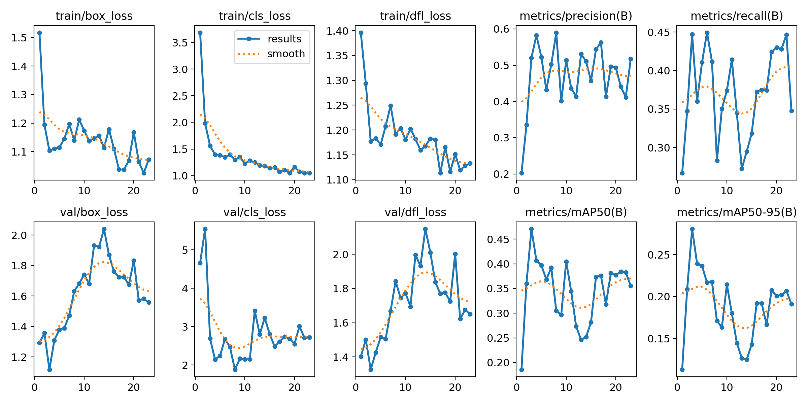
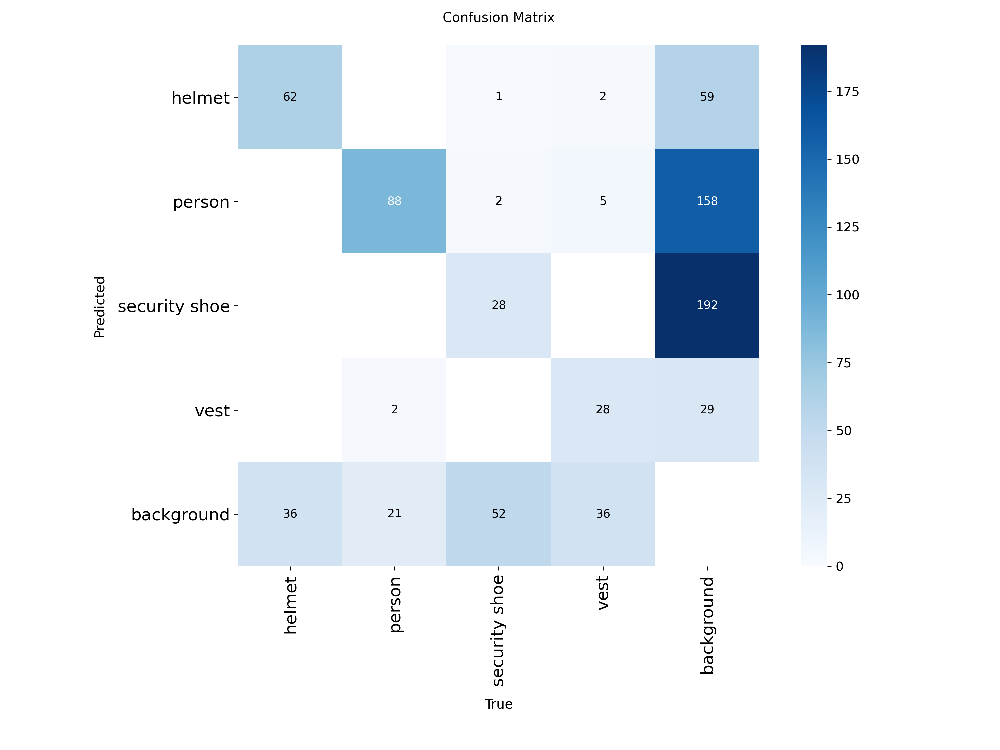

# ppe-detection-aeco
# Detección de Equipos de Protección Personal (EPP) en imágenes de obra usando YOLOv8

## Problema AECO

El sector AECO (Architecture, Engineering, Construction and Operations) presenta una alta incidencia de accidentes laborales en obras. Muchos de estos accidentes se relacionan con la falta de uso de Equipos de Protección Personal (EPP) y con la escasa trazabilidad de condiciones de seguridad en obra.

Este proyecto explora el uso de visión computacional para detectar automáticamente elementos de seguridad en imágenes de obra.

## Criterios de éxito

El objetivo del proyecto es:

- entrenar un modelo reproducible en Google Colab,
- detectar correctamente personas y elementos de EPP,
- documentar métricas, evidencias visuales y limitaciones del modelo.

## Clases del modelo

Las clases utilizadas son:

- person
- helmet
- vest
- security_boots

## Reglas de etiquetado

- person: persona visible en la escena
- helmet: casco de seguridad visible
- vest: chaleco reflectante visible
- security_boots: botas de seguridad visibles

## Dataset

- Fuente: Roboflow
- Formato: YOLOv8
- Split: 80% entrenamiento / 20% validación
- Enlace al dataset:(https://app.roboflow.com/domenicas-workspace/m4t3/browse?queryText=&pageSize=50&startingIndex=0&browseQuery=true)
- Versión del dataset: 4

El dataset utilizado en este proyecto fue construido manualmente a partir de imágenes públicas obtenidas desde la plataforma Unsplash.

Fuente de las imágenes:
https://unsplash.com/s/photos/construction-person-equipment

Las imágenes corresponden a escenas relacionadas con obras de construcción donde aparecen trabajadores utilizando distintos Equipos de Protección Personal (EPP), tales como cascos, chalecos reflectantes y botas de seguridad.

A partir de estas imágenes se realizó un proceso de:

- selección manual de imágenes relevantes
- anotación de objetos mediante Roboflow
- generación de un dataset en formato YOLOv8
- división del dataset en entrenamiento y validación

### Derechos y licencia de las imágenes

Las imágenes utilizadas provienen de Unsplash, una plataforma que distribuye fotografías bajo la licencia Unsplash License.

Esta licencia permite el uso libre de las imágenes, incluyendo usos comerciales y modificaciones, sin requerir permiso previo del autor, siempre que no se utilicen de forma que implique respaldo o promoción directa por parte del fotógrafo.

En este proyecto las imágenes fueron utilizadas únicamente con fines académicos y de experimentación para entrenar un modelo de detección de objetos en el contexto del sector AECO.

## Estructura del repositorio

- `/notebooks/`: notebooks de entrenamiento, evaluación e inferencia
- `/docs/`: problema, clases, análisis de errores y gobernanza
- `/results/`: curvas, métricas y ejemplos de predicción

## Cómo reproducir en Google Colab

1. Abrir el notebook principal desde la carpeta `/notebooks/`.
2. Ejecutar las celdas de instalación de dependencias.
3. Descargar el dataset desde Roboflow.
4. Entrenar el modelo YOLOv8 o cargar pesos ya entrenados si corresponde.
5. Ejecutar validación.
6. Ejecutar inferencia en imágenes de validación e imágenes nuevas.
7. Revisar métricas, curvas y resultados guardados en `/results/`.

## Resumen de resultados

Métricas principales del modelo:

- Precision: 66.8%
- Recall: 43.7%
- mAP50: 40.9%
- mAP50-95: 27.6%

### Conclusiones clave

1. El modelo detecta correctamente personas y parte de los elementos de seguridad.
2. Los objetos pequeños, como cascos, presentan mayor dificultad de detección.
3. La mejora del balance de clases y de las anotaciones podría aumentar el recall.

## Curvas de entrenamiento

A continuación se presentan algunas de las curvas generadas durante el entrenamiento del modelo YOLOv8.

### Resultados generales

### Curva Precision–Recall

### Matriz de confusión

## Checklist de Reproducibilidad

- Dataset / versión: 4
- Enlace al dataset: https://app.roboflow.com/domenicas-workspace/m4t3/4
- Variante del modelo: YOLOv8s
- epochs: 80
- batch: 16
- imgsz: 640
- versión de ultralytics: 8.2.103

## Prueba de reproducibilidad

Última ejecución exitosa: 2026-03-07

Entorno de ejecución
- Plataforma: Google Colab
- GPU utilizada: Tesla T4

Tiempo esperado de ejecución
- Aproximadamente 10–20 minutos con GPU para una verificación corta.

Modo de prueba
- El notebook fue ejecutado completamente desde cero para verificar reproducibilidad.

Parámetros del modelo
- Modelo: YOLOv8s
- epochs: 80
- batch: 16
- imgsz: 640

Resultados generados
- Métricas de validación (Precision, Recall, mAP50, mAP50-95)
- Curvas de entrenamiento
- Predicciones en validación
- Predicciones en imágenes nuevas

- ## Licencia

El código y la documentación de este repositorio se distribuyen bajo licencia MIT.

Esta licencia aplica al código, notebooks y documentación del proyecto.

